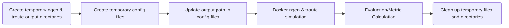

# NextGen Hydrologic Model Calibration

This project calibrates NextGen model parameters with SPOTPY and supports both serial and MPI-parallel execution.

## Table of Contents

- [What This Does](#what-this-does)
- [Prerequisites](#prerequisites)
- [Installation](#installation)
- [Expected Data Layout](#expected-data-layout)
- [Quick Start](#quick-start)
- [Command Line Arguments](#command-line-arguments)
- [Execution Modes](#execution-modes)
- [Understanding the Output](#understanding-the-output)
- [Monitoring Progress](#monitoring-progress)
- [Troubleshooting](#troubleshooting)
- [Workflow](#workflow)
- [Customizing Calibration Parameters](#customizing-calibration-parameters)
- [Additional Notes](#additional-notes)
- [Support](#support)

## What This Does

At a high level, calibration means searching for parameter values that make simulated streamflow match observed streamflow.

This code:

1. Reads model/domain data under `data_root/gage-{gage_id}`.
2. Loads or downloads observed USGS flow for your date range.
3. Runs SPOTPY optimization (`SCE` or `DDS`) against an objective function (`KGE` or `RMSE`).
4. Writes the best parameter set and full optimization history to disk.

## Prerequisites

- Python 3.8+
- OpenMPI or MPICH
- Rust + Cargo (used to install routing dependency)
- Docker (used by model execution)
- Basic familiarity with `ngiab_data_preprocess`

## Installation

1. Clone the repository and enter it.
   ```bash
   git clone https://github.com/slama0077/Spotpy_SL.git
   ```
2. Install OpenMPI.
   - macOS:
     ```bash
     brew install openmpi
     ```
   - Linux:
     ```bash
     sudo apt install openmpi-bin
     ```
3. Verify MPI:
   ```bash
   mpirun --version
   ```
4. Install C compiler, Fortran, Rust/Cargo, and the routing package:
   - Linux (Debian/Ubuntu):
     ```bash
     sudo apt install build-essential gfortran
     sudo apt install -y libhdf5-dev libnetcdf-dev libsqlite3-dev
     curl --proto '=https' --tlsv1.2 -sSf https://sh.rustup.rs | sh
     source ~/.cargo/env
     rustup update stable
     cargo --version
     cargo install --git https://github.com/slama0077/route_rs.git --branch Calibration
     ```
   - macOS (Unix):
     ```bash
     xcode-select --install
     brew install gcc hdf5@1.10 netcdf sqlite
     curl --proto '=https' --tlsv1.2 -sSf https://sh.rustup.rs | sh
     source ~/.cargo/env
     rustup update stable
     cargo --version
     export HDF5_DIR="$(brew --prefix hdf5@1.10)"
     export RUSTFLAGS="-C link-args=-Wl,-rpath,$HDF5_DIR/lib"
     export DYLD_FALLBACK_LIBRARY_PATH="$HDF5_DIR/lib"
     cargo install --git https://github.com/slama0077/route_rs.git --branch Calibration
     ```
5. Create and activate a virtual environment:
   ```bash
   python -m venv .venv
   source .venv/bin/activate
   ```
6. Install Python dependencies from `pyproject.toml`:
   ```bash
   pip install -e .
   ```

## Expected Data Layout

Before running calibration, `data_root` should contain a folder for your gage and supporting data folders:

```text
{data_root}/
└── gage-{gage_id}/
    ├── config/
    │   ├── realization.json
    │   └── troute.yaml
    ├── forcings/
    ├── metadata/
    └── outputs/
```

`data_root` is the parent directory, not the gage folder itself. The `forcings/` and `metadata/` directories are expected alongside `config/` within `gage-{gage_id}`.

Example:

- If your files are in `/tmp/ngen/gage-10163000/config/realization.json`, then `--data_root` should be `/tmp/ngen`.

## Quick Start

### 1) Prepare data

```bash
uvx --from ngiab_data_preprocess cli -i gage-10163000 -sfr --start 2015-06-15 --end 2015-08-15 --source aorc
```

If you are unsure where the generated data lives, check:

```bash
cat ~/.ngiab/preprocessor
```

### 2) Run serial mode (Do not forget to change /path/to/data_root)

```bash
python -u -m calibration --gage_id 10163000 --start_date 2015-06-15 --end_date 2015-08-15 --training_start_date 2015-07-15 --data_root /path/to/data_root --execution_mode serial
```

### 3) Run parallel mode with merge_catchment feature (recommended for speed)

```bash
mpirun -n 11 --oversubscribe python -u -m calibration --gage_id 10163000 --start_date 2015-06-15 --end_date 2015-08-15 --training_start_date 2015-07-15 --data_root /path/to/data_root --execution_mode parallel --merge_catchment True
```

Unbuffered output notes:

- Python buffers stdout when output is redirected or not attached to a terminal, which can make logs appear late or in bursts.
- Use `-u` with `python` to force line-by-line output for live monitoring.

### Optional Arguments and Defaults (all optional)

- `--algorithm` (default: `DDS`, options: `SCE`, `DDS`)
- `--objective_function` (default: `KGE`, options: `KGE`, `RMSE`)
- `--repetitions` (default: `100`)
- `--dds_trials` (default: `1`)
- `--execution_mode` (default: `parallel`, options: `serial`, `parallel`)
- `--merge_catchment` (default: `True`, bool-like string)
- `--merge_area` (default: `330`)

## Command Line Arguments

### Required Arguments

| Argument | Type | Description | Example |
| --- | --- | --- | --- |
| `--gage_id` | string | USGS gage ID used for observed flow retrieval and folder naming | `10163000` |
| `--start_date` | string | Full simulation start date (`YYYY-MM-DD`) | `2015-06-15` |
| `--end_date` | string | Full simulation end date (`YYYY-MM-DD`) | `2015-08-15` |
| `--training_start_date` | string | Start of the calibration/evaluation window inside the simulation period | `2015-07-15` |
| `--data_root` | string | Parent folder containing `gage-{gage_id}` | `/home/user/data` |

### Optional Arguments

| Argument | Type | Default | Options | Description |
| --- | --- | --- | --- | --- |
| `--algorithm` | string | `DDS` | `SCE`, `DDS` | Search algorithm used by SPOTPY |
| `--objective_function` | string | `KGE` | `KGE`, `RMSE` | Metric used to score each parameter set |
| `--repetitions` | integer | `100` | positive integer | Number of optimization iterations |
| `--dds_trials` | integer | `1` | positive integer | DDS restart trials (used only when `--algorithm DDS`) |
| `--execution_mode` | string | `parallel` | `serial`, `parallel` | Controls MPI behavior |
| `--merge_catchment` | bool-like string | `True` | `true/false`, `yes/no`, `1/0` | Enable or skip catchment merging/preprocessing step |
| `--merge_area` | float | `330` | positive float | Catchment area threshold in square km used to merge divides |

### Argument Notes

- `start_date` to `end_date` defines the simulation span.
- `training_start_date` to `end_date` defines the objective-function evaluation window.
- For DDS, increasing `dds_trials` can improve exploration but increases runtime.
- Higher `repetitions` usually improves calibration quality but increases runtime linearly.

### Help

```bash
python -m calibration --help
```

## Execution Modes

### Serial Mode

- Runs with one process (no MPI worker pool).
- Best for debugging and first-run validation.
- Command pattern:
  `python -m calibration ... --execution_mode serial`

### Parallel Mode

- Runs with MPI workers for faster calibration.
- Rank 0 is coordinator; worker ranks execute simulations.
- If you need `N` worker simulations, use `mpirun -n N+1`.
  - Example: 10 workers -> `mpirun -n 11`.

## Understanding the Output

### Directory Structure

```text
data_root/gage-{gage_id}/
├── calibration/
│   ├── spotpy/
│   │   ├── best_params.csv              # Best calibrated parameters
│   │   ├── spotpy_results_<ALG>_<OBJ>.csv
│   │   └── plots/                       # Optional diagnostic plots
│   ├── tensorboard_logs/
│   │   └── <run_name>/
│   └── archive/
│       ├── {merge_area}/
│           ├── merged.gpkg                  # Merged geopackage for a given merge area(when merge_catchment=True)
│           └── forcings.nc                  # Forcings used for merged simulation
└── config/
    └── realization.json             # Updated with best parameters
```

### `best_params.csv`

One-row CSV containing the winning parameter set.

### `spotpy_results_<ALG>_<OBJ>.csv`

Full optimization history, including tried parameter vectors and objective values. Use this file when you want to analyze convergence behavior.


## Monitoring Progress

Run TensorBoard in another terminal:

```bash
tensorboard --logdir=/path/to/data_root/gage-{gage_id}/calibration/tensorboard_logs
```

Then open: `http://localhost:6006`

Useful dashboards:

- objective function trend
- parameter traces
- hydrograph comparisons
- error metrics (NSE, KGE, RMSE, MAE)
- residual behavior

## Troubleshooting

### Issue: Not enough slots available

**Error:** `There are not enough slots available in the system`

Use `--oversubscribe` with `mpirun`:

```bash
PYTHONUNBUFFERED=1 mpirun -n 20 --oversubscribe calibration [arguments]
```

### Issue: Process hangs or does not complete

1. Check Docker with:
   ```bash
   docker run hello-world
   ```
2. If permission errors appear, follow Docker post-install steps:
   <https://docs.docker.com/engine/install/linux-postinstall/>

### Issue: Rank 0 does not run simulations

This is expected in parallel mode. Rank 0 coordinates work; worker ranks run the model.

### Issue: Missing observed flow file

The script auto-downloads observed USGS flow if not already cached.

Verify:

1. internet access
2. valid `gage_id`
3. data availability for your date window

USGS portal: <https://waterdata.usgs.gov/nwis>

### Issue: Docker command fails during model execution

1. Confirm image exists:
   `docker images | grep awiciroh/ciroh-ngen-image`
2. Confirm read/write permissions under `data_root`.

## Workflow

### Parallel Calibration

<p align="center">
  
</p>

### Simulation and Evaluation


## Customizing Calibration Parameters

You can change which parameters are calibrated (and their bounds/initial guesses) by editing `src/calibration.py`.

- Update `CFE_PARAMS` and `NOAH_PARAMS` to add/remove parameters or adjust `Uniform(min, max, optguess=...)`.

## Additional Notes

### Algorithm Selection

- `SCE`:
  - broader global exploration
  - often more robust on difficult parameter spaces
- `DDS`:
  - typically faster to useful solutions
  - efficient for high-dimensional tuning
  - tune `--dds_trials` for exploration depth

### Recommended Workflow

1. Run a short serial smoke test (`--repetitions 10`).
2. Run parallel calibration with moderate iterations (`100-200`).
3. Inspect TensorBoard and `spotpy_results_*.csv` for convergence.
4. Increase repetitions if objective trend is still improving.
5. Validate best parameters on a different time period.

## Support

1. Inspect TensorBoard logs first.
2. Inspect `spotpy_results_*.csv` for failures/outliers.
3. Reference SPOTPY docs: <https://spotpy.readthedocs.io/>
